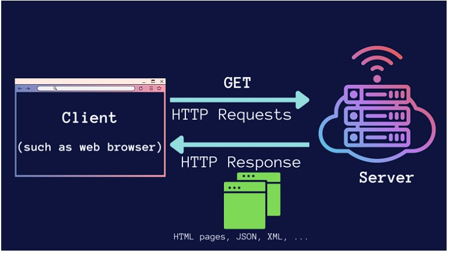

<h1><a name="readme-top"></a></h1>

[](https://github.com/marcossilvestrini/labs/actions/workflows/check-ngix-stack.yml)

# HTTP



<p align="center">
<strong>Explore the docs »</strong></a>
    <br />
    <a href="https://github.com/marcossilvestrini/labs">Main Page</a>
    -
    <a href="https://github.com/marcossilvestrini/labs/issues">Report Bug</a>
    -
    <a href="https://github.com/marcossilvestrini/labs/issues">Request Feature</a>
</p>

## Summary

<details>
  <summary><b>TABLE OF CONTENT</b></summary>
  <ol>
    <li>
      <a href="#about-the-project">About The Project</a>
    </li>
    <li>
      <a href="#getting-started">Getting Started</a>
      <ul>
        <li><a href="#prerequisites">Prerequisites</a></li>
        <li><a href="#installation">Installation</a></li>
      </ul>
    </li>
    <li><a href="#usage">Usage</a></li>
    <li><a href="#roadmap">Roadmap</a></li>
    <li><a href="#freedoms">Four Essential Freedoms</a></li>
    <li><a href="#license">License</a></li>
    <li><a href="#contact">Contact</a></li>
    <li><a href="#acknowledgments">Acknowledgments</a></li>
  </ol>
</details><br>

<a name="about-the-project"></a>

## About Project

This project up a stack of HTTP server for labs.

## Whats is?

In this project, I up a stack of HTTP server with nginx and nginx.

### Vagrant

 I use vagrant for provision all http server in this project.

### Shell provisioner

I use vagrant shell provisioner for configure http service and others tools of this stack

### Git Actions (pipelines)

I use git actions for create a pipeline for my test in http stack

### Slack API

I use slack api and git actions for send a test that I execute after all
push\pull in this repository

<p align="right">(<a href="#readme-top">back to top</a>)</p>

<a name="getting-started"></a>

## Getting Started

This is an example of how you may give instructions on setting up your project locally.
To get a local copy up and running follow these simple example steps.

<a name="prerequisites"></a>

### Prerequisites

This is an example of how to list things you need to use the software
and how to install them.

* git
* Virtual Box and extension
* Vagrant

<a name="installation"></a>

### Installation

Clone the repo

```sh
git clone https://github.com/marcossilvestrini/labs.git
```

<a name="usage"></a>

## Usage

```sh
cd vagrant/linux/nginx
vagrant up
```

<p align="right">(<a href="#readme-top">back to top</a>)</p>

<a name="roadmap"></a>

## Roadmap

* [x] Install and Configure Ngix
  * [x] Create script for install and configure nginx
  * [x] Create script for install and configure nginx
  * [x] Create script for install and configure nginx
  * [x] Configure Https for all sites
  * [x] Configure Virtual host for all sites
  * [x] Configure authentication and authorization modules for sites(.htaccess,.htpasswd)
* [x] Configure Reverse Proxy(loadbalance)
* [x] Create script for test nginx Stack
  * [x] Check Service is Running
  * [x] Check Version
  * [x] Check Status HTTP
  * [x] Check Status Module PHP
  * [x] Check Status Module Perl
* [x] Create pipeline for print test
* [x] Create pipeline for send test in slack channel

<p align="right">(<a href="#readme-top">back to top</a>)</p>

## Contributing

Contributions are what make the open source community such an amazing place to
learn, inspire, and create. Any contributions you make are **greatly appreciated**.

If you have a suggestion that would make this better, please fork the repo and
create a pull request. You can also simply open an issue with the tag "enhancement".
Don't forget to give the project a star! Thanks again!

1. Fork the Project
2. Create your Feature Branch (`git checkout -b feature/AmazingFeature`)
3. Commit your Changes (`git commit -m 'Add some AmazingFeature'`)
4. Push to the Branch (`git push origin feature/AmazingFeature`)
5. Open a Pull Request

## License

* This project is licensed under the MIT License * see the LICENSE.md file for details

## Contact

Marcos Silvestrini - marcos.silvestrini@gmail.com \
[](https://twitter.com/mrsilvestrini)

Project Link: [https://github.com/marcossilvestrini/labs](https://github.com/marcossilvestrini/labs)

<p align="right">(<a href="#readme-top">back to top</a>)</p>

## Acknowledgments

* [http Logging](https://www.zytrax.com/books/dns/ch7/logging.html)
* [nginx](https://www.nginx.org/)
* [Nginx](https://www.nginx.com/)

<p align="right">(<a href="#readme-top">back to top</a>)</p>
